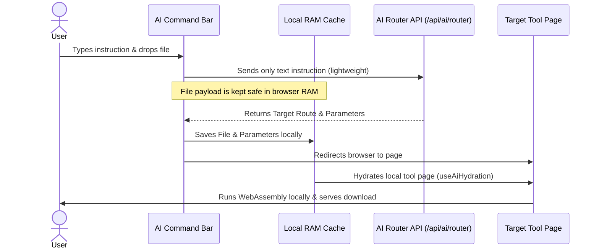

# 🚀 Core Philosophy & Overview

Welcome to the heart of Pixie. This document explains the core philosophy, capabilities, and system design behind Pixie's local-first file processing model.

---

## 🔮 The Core Philosophy: "Local File Alchemy"

Most web utilities send your sensitive invoices, private photos, and videos to cloud servers for processing. This presents major privacy risks, high bandwidth costs, and server lag. 

Pixie changes this by loading **compiled WASM (WebAssembly) binaries, canvas context engines, and standard Web APIs** directly into the user's browser:
1. **100% Client-Side Privacy:** Your files never touch our servers. All operations happen in-memory.
2. **Instant Execution:** Browser-side processing processes images, extracts audio, or formats data in milliseconds without network delays.
3. **No File Limits:** Since compute happens on your own hardware (CPU/GPU), there are no artificial file upload caps.

This local-first approach transforms the browser from a simple viewer into a powerful file-processing workstation. We refer to this paradigm as **Local File Alchemy**.

---

## 🔒 Security & Privacy Architecture

By executing all file processing locally in the browser sandbox, Pixie eliminates common web security vulnerabilities:

```
[ Traditional File Converters ]
User File  ───(Internet Upload)───>  Cloud Server  ───(Processing)───> Temp Disk Storage ───> Download Link

[ Pixie Local-First Alchemy ]
User File  ───(RAM / Blob URL)───>  Browser Sandbox (WASM & Web APIs)  ───(Direct Download)───> Done
```

*   **Zero Server Logs:** No server-side file logs or temporary storage directories exist. Files reside temporarily in browser RAM or indexed local storage blobs.
*   **Encapsulated Execution:** Process runtimes (such as FFmpeg WASM) are isolated within browser Web Workers, preventing cross-tool memory leakage.
*   **Offline Functionality:** Once the application assets are loaded in the browser cache, all tools (excluding the optional AI semantic routing) operate completely offline without any internet connection.

---

## ⚡ The Key Benefits

*   **Absolute Privacy:** Ideal for sensitive government documents, private medical images, proprietary codebases, or commercial financial sheets.
*   **Zero Network Overhead:** No uploading 100MB video files only to download them again. Data transitions from source to destination directly on the local machine.
*   **Compute Scalability:** Pixie scales with the user's computer. A developer with a high-end multi-core CPU experiences lightning-fast rendering of large videos, while server costs remain zero.
*   **No Queue Delay:** Traditional cloud queues force users to wait for other jobs to finish. Pixie runs immediately.

---

## 🪄 The User Journey



1.  **Semantic Entry:** The user lands on the dashboard and inputs what they want to achieve (e.g. *"Compress my profile image to under 100kb"*).
2.  **File Staging:** The user drops one or more files into the browser.
3.  **Instruction Routing:** The text prompt is sent to the AI Router API to identify the target tool. The heavy files remain safe on the local device.
4.  **Local Hydration:** The user is redirected to the tool page. The files and target parameters (e.g. `100KB` limit) are injected into the page's React state.
5.  **Processing & Save:** The page compiles the file locally and issues a `Blob URL` for immediate, private download.
